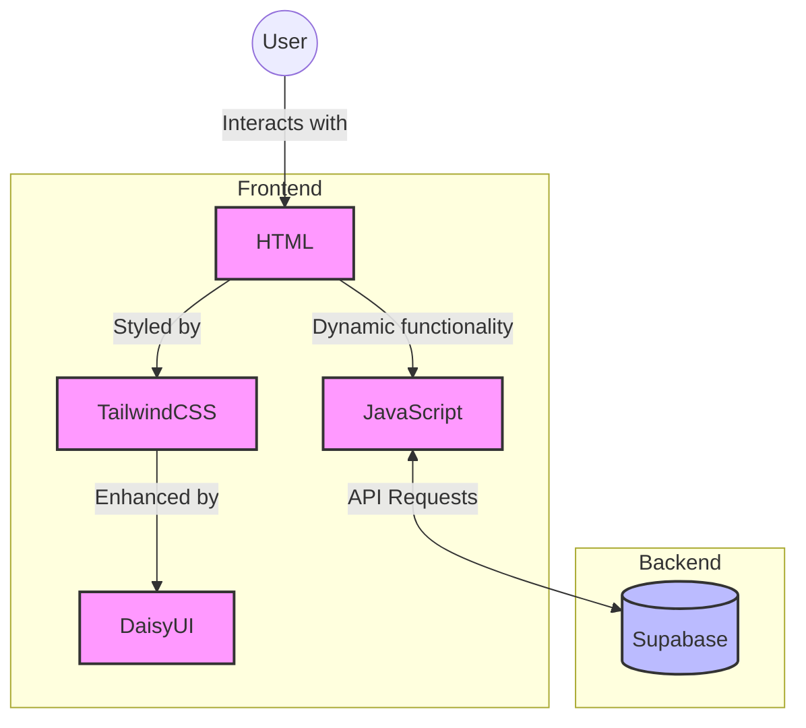

# Blog Builder Project

This project is a comprehensive walkthrough for building a blog using modern web technologies. The frontend is constructed with HTML, styled using TailwindCSS and DaisyUI, and enhanced with JavaScript for interactivity. The backend is powered by Supabase, providing a robust and scalable infrastructure for data management.

## Project Overview

- Frontend: HTML, TailwindCSS, DaisyUI, JavaScript
- Backend: Supabase
- Purpose: Create a fully functional blog with a sleek, responsive design

### Features
- [x] All readers to see all posts
- [ ] All users to add a new post - (TODO v1)
- [ ] All users to delete a post
    - [ ] When hits "delete" button from each post (frontend)
    - [ ] remove the post from supabase (backend)
    - [ ] refresh the page (frontend)